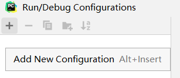

## *安装指南*

* 版本要求
    1. Python >= 3.0.0 (如 *Python 3.9.5*)
    2. mysql 版本随意 (如 *mysql 8.0.22*)
* 安装步骤
    1. 执行 *douban.sql* 中的sql语句，导入数据库与数据表
        * 登录 mysql 数据库  
          
        * 执行 *source douban.sql*  
          
        * (可选) 检查执行结果
          
    2. 将自己的数据库用户名和密码写入 *settings.py* 第85、86行
        * 
    3. 执行 *pip install -r requirements.txt* 语句，导入依赖
        * 
* 温馨提示
    1. 建议添加 *mysql* 环境变量
    2. 执行安装步骤*3* 时建议使用 *PyCharm* 运行
* 可能遇到的问题
    1. *Q:* 执行 *source douban.sql*  时遇到问题  
       
       *A:* 把目标文件移动到命令行执行目录下(如 *C:\User\dyf*)，或目标文件完整的路径(如 *D:\book-recommendation\douban.sql*)  
    2. *Q:* 网速太慢了  
       *A:* 建议使用国内镜像源